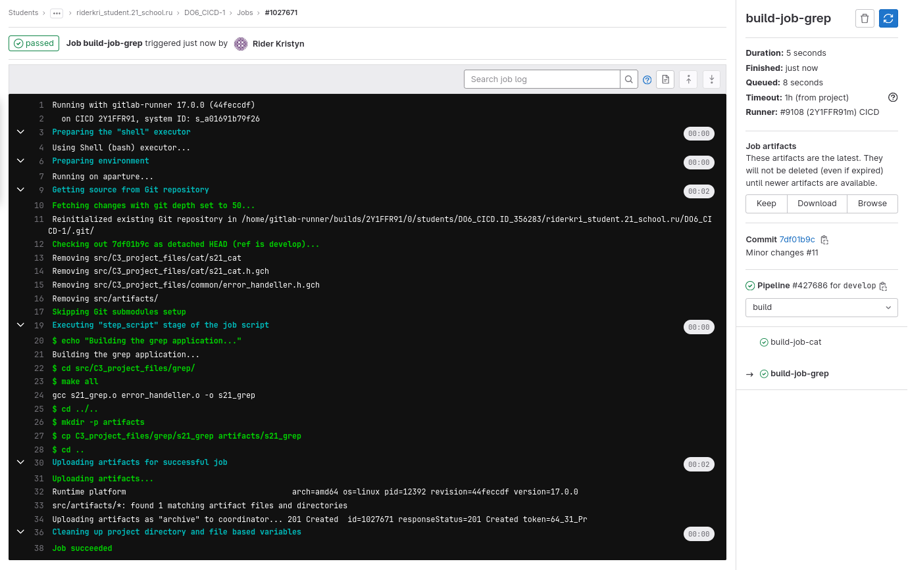

# Basic CI/CD


## Contents
1. [Some explanation](#part-0-some-explanation)
2. [Setting up the gitlab-runner](#part-1-setting-up-the-gitlab-runner)  
3. [Building](#part-2-building)  
4. [Codestyle test](#part-3-codestyle-test)   
5. [Integration tests](#part-4-integration-tests)  
6. [Deployment stage](#part-5-deployment-stage)  
7. [Bonus. Notifications](#part-6-bonus-notifications)  
4. [The end](#the-end)

## Part 0. Some explanation 

### Basics 

* [**CI/CD**](https://youtu.be/Hkq_78xSfSY?si=lXUiY6rDMs3TQPtA) - *continuous integration and continuous delivery*.

* **CI/CD** pipeline - a sequence of actions (scripts) for a particular version of the code in the repository, which is started automatically when changes are made.

* **CI** (Continuous Integration) refers to the integration of individual pieces of application code with each other. 
* **CI** normally performs two tasks as described below:
    - BUILD:
        - Checking if the code is being built at all;
        - Prepare the artifacts for the next stages;
    - TEST:
        - Codestyle tests;
        - Unit tests;
        - Integration tests;
        - Other tests you have;
        - Test reports.

* **CD** (Continuous Delivery) is a continuous integration extension, as it automatically deploys all code changes to the test and/or production environment after the build stage.
* **CD** can perform the following tasks:
    - PUBLISH (If using a deployment docker):
        - Build container images;
        - Push the images to where they will be taken from for deployment;
    - UPDATE CONFIGS:
        - Update configuration on the machines;
    - DEPLOY STAGING:
        - Deployment of test environment for manual tests, QA, and other non-automated checks;
        - Can be run manually or automatically if CI stages are passed successfully;
    - DEPLOY PRODUCTION:
        - Deploying a new version of the system on "production";
        - This stage better be run manually rather than automatically;
        - If you want, you can set it up for a specific branch of the repository only (master, release, etc.).

### Parts' comments

| Place in <br> report | Explanation |
|---|---|
| **Part 1: 3**| **--non-interactive** - tells the runner to register in non-interactive mode (it won't prompt the user to enter any information manually);<br> **--url "..."** - specifies the URL of the GitLab instance that the runner will connect to. <br> **--registration-token "..."** - provides the registration token that is used to authenticate the runner with the GitLab instance. <br> **--executor "..."** - specifies the executor that the runner will use to run jobs. <br> **--description "CICD"** - sets a description for the runner. |
| **Part 2: 2**| In GitLab Runner, **artifacts** are files or directories that are generated during a job's execution, and can be preserved and passed between jobs or stages. <br> *Artifacts* can be defined in *.gitlab-ci.yml* file using the "*artifacts*" keyword. The paths to the files or directories that should be saved as artifacts could be specified.|
| **Part 3: 1** | This files does not like *then* on another line after *if* line, so its better to write: **if ...; then**|
| **Part 3: 2** | Fun fact: Uubuntu's *clang-format*  version is 18, Verter's is 17, Fedora's is 17. Code **for();** - works for Ubuntu, but does not work for Verter and Fedora (those need either **for(){}; or for() >\n< ;**).|
| **Part 4: 1** | **needs** specifies that this job depends on the successful completion of other jobs, regardless of their stage order.|
| **Part 4: 1** <br> **Part 5: 9** <br> **Part 6: 5**| **chmod 755 ~filename~** <br>   Permissions are added together for each class (user, group, others):<br>* User (u): 4 (read) + 2 (write) + 1 (execute) = 7 <br>* Group (g): 4 (read) + 1 (execute) = 5<br>* Others (o): 4 (read) + 1 (execute) = 5 |
| **Part 5: 5** |   **when: manual** - the pipeline should be continued manualy via gitlab site.|
| **Part 5: 6-7** | **sshpass -p '...'** - allows to specify password when run an *ssh bash command* (inc *scp*). It is put at the beginig of the line (befor the command), *-p* for *password*, that must be put in *'  '*.|
| **Part 5: 7** | **-o StrictHostKeyChecking=no** - temporary workaround, allow to bypass the host key verification process (don't need to type "yes" manually at first ssh connection.)
|**Part 5: 7**| **scp [file]  [remote_login]@[remote_ip]:[destination/file]** - allows to transfer files via *ssh*.|
|**Part 5: 7**| **$?** - variable that the exit status of the last command executed.|
|**Part 5: 7**| **ssh [remote_login]@[remote_ip] "[command #1]; [command #2];[command #3]"** - allows to execute commands without entering the remote terminal.|
|**Part 5: 8**| **chown -R [usr] [directory]** - chang/add the an owner of the directory (-R -- recursive).|
|**Part 6: 6**| GitLab CI/CD provides some **predefined** [**variables**](https://docs.gitlab.com/ee/ci/variables/) that can be used in your .gitlab-ci.yml file and scripts (ex. to store values you want to re-use), such as: <br> CI_COMMIT_MESSAGE<br> CI_COMMIT_DESCRIPTION (Message except 1st line)<br> CI_COMMIT_BRANCH<br> CI_COMMIT_TITLE (1st line of the massege)<br> CI_JOB_ID <br> CI_JOB_NAME<br>CI_JOB_STAGE (The name of the job’s stage.) <br> CI_JOB_STATUS (Used with *after_script*. Can be *success*, *failed*, or *canceled*.)<br> CI_PIPELINE_URL <br> CI_PROJECT_NAME<br>CI_PROJECT_TITLE (human-readable project name)<br> CI_PROJECT_VISIBILITY (internal, private or public)<br> CI_REPOSITORY_URL (usable for *git clone*)<br> GITLAB_USER_LOGIN (the one that started the pipeline)|
|**Part 6: 6**| [**curl -X POST -s -o /dev/null -d text="..." [URL]**](https://youtu.be/86NmQjhyfjc?si=QEKak6T8qNPGoe7D): <br> * *-X POST* - option (*-X*) specifies that the request should use the *POST* method, that is used in the HTTP (Hypertext Transfer Protocol) protocol to send data to a server. <br> * *-s* - silent <br> * *-o /dev/null*  - send the incoming reply (the result of curl command) to nowhere. <br> * *-d* - attach data to the request sent by curl.|
|**Part 6: 4**| [**after_script**](https://docs.gitlab.com/ee/ci/yaml/index.html#after_script) - used to define an array of commands to run last (after a job’s *before_script* and *script* sections complete). after_script commands also run when the *script_failure* and if canceled. Can be written after all jobs so will become a part of all of them.|

## Part 1. Setting up the [**gitlab-runner**](https://youtu.be/-CyVpfDQAG0?si=n-eErGwd_oJu_7lS)

1. Start *Ubuntu Server 22.04 LTS* virtual machine.
2. Create a mount folder that we will use to transfer files. And a [script file](active_script.sh) that we will use to input complex commands into the virtual uduntu server.

    

2. Download and install **gitlab-runner** on the virtual machine. To do it we will use:
    ```shell
    sh active_script.sh 1
    sh active_script.sh 2
    ```
3. Run **gitlab-runner** and register it for use in the current project (a *URL* and a *token* for runner registration will be obtained from the task page on the platform). This can be done running `sh active_script.sh 3` (the *URL* and *token* and already written in the *script file*).

    


## Part 2. Building

1. Pull from repository and put files of a project to **C3_project_files** folder. This project's goal is to emulate *grep* and *cat* from commands of Linux.

2. Write **.gitlab-ci.yml** file with a stage to start the building via makefile of the project.
And save post-build files (artifacts) to specially created directory for a 30-days period. Locate this file in the root directory of the project.

    

3. Commit and push changes to repository and check the *Gitlab* >> *Jobs* to see if everything is works well.

       

     


## Part 3. Codestyle test

1. Add a new stage and new job to **.gitlab-ci.yml** file to run codestyle test (testing with*clang-format*).

     

     

2. Install *clang-format* at the *virtual machine*.

3. Try with already formated file:

     

4. Lets change *s21_grep.c* so it won't pass *clang-format* and see the result we get from *gitlab-runner*.

     

## Part 4. Integration tests

1. Write stages for **CI** that runs *integration tests* for cat *and* *grep* (I won't use echo from this part, because it's not actually needed much). This stage will be run automatically only if the right build and codestyle test passes successfully. Don't forget thet sh-files need to hade adjusted rights to be run by runner.

     

2. Lets commit, push and check:

    

    

    

    


## Part 5. Deployment stage

1. Start the second virtual machine *Ubuntu Server 22.04 LTS* kind.

    

2. In *VirtualBox* app creating new NAT network (*10.255.255.0/24*).

3. Add new network connection to both VMs (network from *Part 5: 2*).

4. Use `ip r` to know IP addresses of both machines.

    |||
    |---|---|
    | github runner VM |10.255.255.4|
    | device VM | 10.255.255.5|

5. Write a new job (and new stage) that will be deploying the result of the building at the **new *VM***. The job will be able to start only **if all the previous jobs are successfull** and it will be needed to be **started manually**. the process of deployment will be written in **deployment.sh** script file so in the job we just run this file.

    

6. Install *sshpass* at the *gitlab-runner VM*.

7. Creating the **deployment.sh** script file which copies the files received after the building (artifacts) into the */usr/local/bin* directory of the second virtual machine using **ssh** and **scp**:

    

8. According to task we will need to put the executable files we created befor to the */usr/local/bin* directory, to make this possible, the ownership of the folder should be adjusted `sudo chown -R user1 /usr/local/bin`.

9. Dont forget to give rights for **deployment.sh** to be executed: `chmod 755 deployment.sh`.

10. Chack that everything works with *gitlab* and check the result of deployment at the *VM*.

    

    


## Part 6. Bonus. Notifications

1. Creating new telegram bot with *BotFather bot*. From the last message we get **bot tocken**.

    

2. Lets check out bot with the **bot tocken** and URL: `https://api.telegram.org/bot>>BOT_TOKEN<</getme`.

    

3. Writing anything to the bot and checing `https://api.telegram.org/bot>>BOT_TOKEN<</getupdates` URL. From that page we can get *ID* of the dialogue with be bot, we will need it later.

    

4. Writing an *after_script* away from all the jobs so it will be wxwcuted with all of them.

    

5. Just for better control, let's create a new stage **pre-deploy** so we will get a message when the deployment is ready and *gitlab-runner* requires our attention.

    

6. Creat **bot_control.sh** and give the rights to run it to *gitlab-runner* with *chmod*.

    

7. Commiting, pushing and checking messages in telegram:

     

<br><br><br><br><br><br><br><br><br><br><br><br><br><br><br><br><br><br>

## The END.
