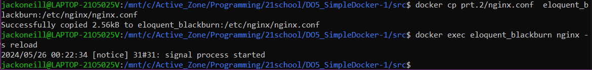
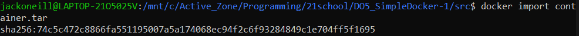
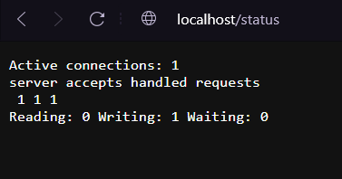
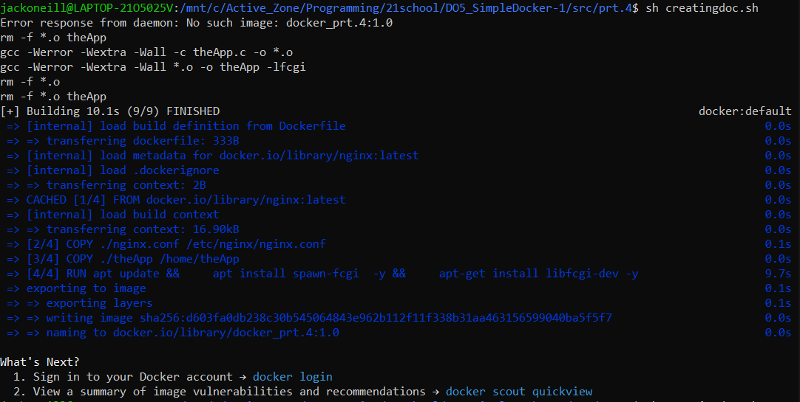
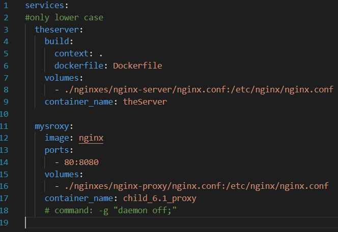

1. [Ready-made docker](#part-1-ready-made-docker)  
2. [Operations with container](#part-2-operations-with-container)  
3. [Mini web server](#part-3-mini-web-server)  
4. [Your own docker](#part-4-your-own-docker)  
5. [Dockle](#part-5-dockle)  
6. [Basic Docker Compose](#part-6-basic-docker-compose)

## Part 1. Ready-made docker

1. Downloading the official docker image of **nginx**: `docker pull nginx`.

    

2. Checking for the docker image at local place: `docker images`.

    

3. Running docker image (create container):
    ```shell
        #docker run -d [image_id|repository]
        docker run -d nginx
    ```
    

4. Checking that the image is running: `docker ps`.

    

5. Checking container information:
    ```shell
    docker inspect [container_id|container_name]
    docker inspect upbeat_cerf
    ```

    

    5.1. The container size, list of mapped ports and container ip:

    

    


6. Stopping docker container and checking that the image has stopped:
    ```shell
    #docker stop [container_id|container_name]
    docker stop upbeat_cerf
    docker ps
    ```

    

7. Running docker with ports **80** and **443** in container, mapping to the same ports on the local machine: `docker run -p 80:80 -p 443:443 -d nginx`.

    

8. Checking that the **nginx** start page is available in the browser (**localhost:80**).

    

9. Restarting the docker container and check that the container is running well.
    ```shell
    docker restart eloquent_blackburn
    docker ps
    curl localhost:80
    ```

    


## Part 2. Operations with container

1. Reading the *nginx.conf* configuration file inside the docker container: `docker exec eloquent_blackburn cat /etc/nginx/nginx.conf`.

    

2. Creating *nginx.conf* file on a local machine, configuring it on the */status* path to return the **nginx** server status page.

    

3. Copying the created *nginx.conf* file inside the docker image  and restarting  **nginx** inside the docker image with.
    ```shell
    docker cp prt.2/nginx.conf  eloquent_blackburn:/etc/nginx/nginx.conf
    docker exec eloquent_blackburn nginx -s reload
    ```

    


4. Checking if *localhost:80/status* returns the **nginx** server status page.

    

5. Exporting the container to a *container.tar* file and stopping the container. Check if it actually stopped.
    ```shell
    sudo docker export eloquent_blackburn > container.tar
    docker stop eloquent_blackburn
    docker ps
    ```
    

6. Deleting the image without removing the container.
    ```shell
    #docker rmi [image_id|repository]
    sudo docker rmi nginx -f
    ```

    

7. Deleting stopped original container:`docker rm eloquent_blackburn`.

    

    * In desktop app we can see that there is no more containers:

        

8. Importing container that was saved before (the container will be located in images folder before it would be started the first time):`sudo docker import container.tar`.
    
    

9. Running the imported container (at the same ports as in Part1:7): `sudo docker run -d -p 80:80 -p 443:443 74c5c472c8866fa551195007a5a174068ec94f2c6f93284849c1e704ff5f1695 nginx -g "daemon off;"`.

    

    * **-d** - this flag tells Docker to run the container in detached mode, which means it will run in the background and not attach to the current terminal session.
    * **nginx** - this is the command to run inside the container, it starts the Nginx web server.
    * **-g "daemon off;"** - will start the nginx server in the foreground and display the logs in the terminal.

10. Checking the status page in browser:

    

## Part 3. Mini web server
1. `sudo apt-get install libfcgi-dev`
2. Creating **theapp.c** file:

    

3. Creating **Makefile**:

    

4. Specifying **nginx.conf** file:

    

5. Creating and starting nginx server same way as *Part 1: 1-3*, but `docker run -d -p81:81 --name child_3 nginx`. And input *.conf* file from *Part 3: 4* same way as in *Part 2: 3*.

6. Compiling **theapp.c** with `make all` command.

7. Copying resulting **theApp** executable file into the container: `docker cp theApp serene_bartik:/home/theApp`

8. Getting into the container to install stuff that we will need `sudo docker exec -it child_3 bash`, and installing needed library+.
    ```shell
        apt update
        apt install spawn-fcgi
        apt-get install libfcgi-dev
    ```
9. Running  **theApp** inside the container properly and exiting the container.
    ```shell
        ch home/
        spawn-fcgi -p 8080 ./theApp

        exit
    ```

    

    * **spawn-fcgi** - command used to start a FastCGI (Fast Common Gateway Interface) server by spawning a new process and setting up the necessary environment for the FastCGI program to run. FastCGI is a protocol for interfacing interactive programs with a web server. 

10. Rebooting the nginx:` docker exec child_3 nginx -s reload`
11. Checking the status page in browser at *localhost:81*:

    

12. Keeping the **nginx.conf** in *prt.3/nginx/* for later.


## Part 4. Your own docker
1. Absorb specification of the docker image we mean to write. It must:

    1.1. build mini server sources on FastCgi from *Part 3*;

    1.2. run it on port 8080;

    1.3. copy inside the image written *./nginx/nginx.conf*;

    1.4. runs **nginx**.

2. Creating **Dockerfile**:

    

3. Creating **creatingDock.sh** - script file to create the image based on the **Dockerfile**.

    

4. Executing the **creatingDock.sh** aka creating the image:

      

5. Checking with `docker images` that everything is built correctly:

     

6. Runing the built docker image and *mapping port 81 to 80 on the local machine* and *mapping the *./nginx* folder inside the container to the address where the **nginx** configuration files are located*. To make this task easier lets create **creatingContainer.sh**.

    

7. And execute it:

    

8. Checking that the page of the written mini server is available on *localhost:80*:`curl localhost:80`.

    

9. Adding */satus* page to our server by upgrading local **nginx.conf** file (same as in *Part 2: 2*) and restarting the container.

    

    

10. Checking **localhost:80/status**:

    

## Part 5. **Dockle**
 * The security check

1. Installing **Dockle**:
    ```shell
    VERSION=$(curl --silent "https://api.github.com/repos/goodwithtech/dockle/releases/latest" | grep '"tag_name":' | sed -E 's/.*"v([^"]+)".*/\1/') && curl -L -o dockle.deb https://github.com/goodwithtech/dockle/releases/download/v${VERSION}/dockle_${VERSION}_Linux-64bit.deb
    sudo dpkg -i dockle.deb && rm dockle.deb
    ```

2. Checking the image:`dockle docker_prt.4:1.0`:

    

3. One of the biggest issues is there due to original nginx image, due to that fact, all the Dockerfile should be rewritten.

    

    * Health checker uses the *curl* command to send a request to *localhost:80* (the fcgi port). The -f option tells curl to fail if the HTTP response code is not 2xx or 3xx (4xx and 5xx - errors). If the *curl* command fails, the *exit 1* command is run, which causes the healthcheck to fail.

4. Furthermore we will need to adjust *nginx.conf* file (will just create a new config-file in the current folder):

    

5. Accordingly will change *bash-files* that are ment to create image and container:

    
    
    

6. Creating new image and checking if there is no **errors** and **warnings**:

    

7. Creating container and checking if everithing at server works well:

    

    


## Part 6. Basic **Docker Compose**

1. Listing specifications of a *docker-compose.yml*, the file should be able to:

    1.1. Start the docker container from *Part 5*. It must work on local network (using **EXPOSE** instruction and map ports to local machine is not required).
    
    1.2.  Start the docker container with **nginx** which will proxy all requests from port 8080 to port 81 of the first container.

2. Bringing **nginx.conf** from *Part 5* and placing it into **nginxes/nginx-server/**.
3. Bringing **Dockerfile** from *Part 5* and changing it due to the **nginx.conf** new location accordingly:
    
    

4. Creating new **nginxes/nginx-proxy/nginx.conf** file that will specify the work of the *nginx* proxy server we make.
    
    

5. Creating the **docker-compose.yml** file (don't forgetting about mapping port 8080 of the second container to port 80 of the local machine):

    

6. Creating **run_me.sh** - script file to run the **docker-compose.yml** building properly.

    

7. Building and runnign the whole project (checking via terminal too).

    ```shell
    docker-compose build
    sudo docker-compose up -d
    ```
    

8. Double checking with a browser:

    

    


## The END.

