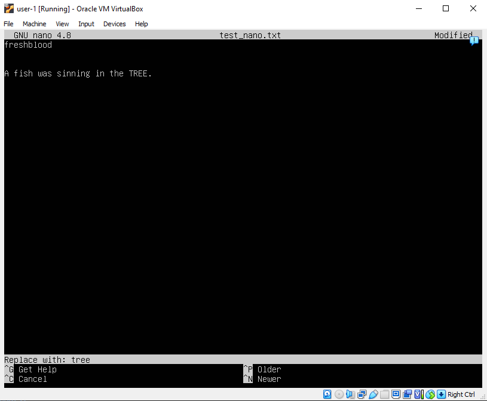
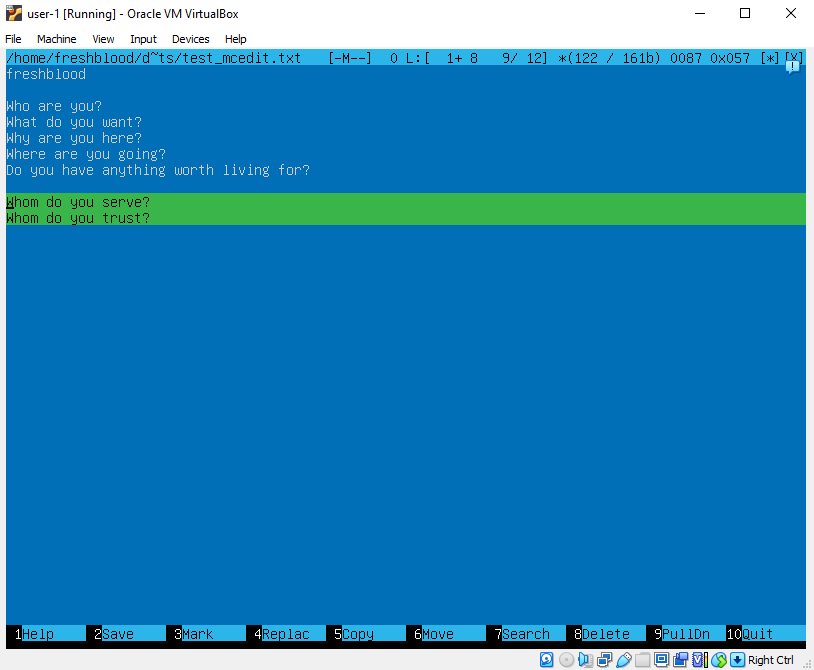

# Report of the project "Linux operating systems " 

## Contents

1. [Part 1. Installation of the OS](#part-1-installation-of-the-os)
2. [Part 2. Creating a user](#part-2-creating-a-user)
3. [Part 3. Setting up the OS network](#part-3-setting-up-the-os-network)
4. [Part 4. OS Update](#part-4-os-update-updating-the-system-packages-to-the-latest-version)
5. [Part 5. Using the **sudo** command](#part-5-using-the-sudo-command)
6.  [Part 6. Installing and configuring the time service](#part-6-installing-and-configuring-the-time-service)
7. [Part 7. Installing and using text editors](#part-7-installing-and-using-text-editors)
8. [Part 8. Installing and basic setup of the **SSHD** service](#part-8-installing-and-basic-setup-of-the-sshd-service)
9. [Part 9. Installing and using the **top**, **htop** utilities](#part-9-installing-and-using-the-top-htop-utilities)
10. [Part 10. Using the **fdisk** utility](#part-10-using-the-fdisk-utility)
11. [Part 11. Using the **df** utility](#part-11-using-the-df-utility)
12. [Part 12. Using the **du** utility](#part-12-using-the-du-utility)
13. [Part 13. Installing and using the **ncdu** utility](#part-13-installing-and-using-the-ncdu-utility)
14. [Part 14. Working with system logs](#part-14-working-with-system-logs)
15. [Part 15. Using the **CRON** job scheduler](#part-15-using-the-cron-job-scheduler)
16. [The grand finale](#finale)


## Part 1. Installation of the OS

1.  [Installing Ubuntu 20.04 Server LTS](extra_files/installation.md)
2. Check Ubuntu version (Result of command):
`
cat /etc/issue
`

    


## Part 2. Creating a user

1.  Add new user: <br>

2.  Give this user adm rights:
`
usermod -aG adm freshblood
`
3.  `cat /etc/passwd` results: <br>


## Part 3. Setting up the OS network

1.  Setting the machine name as user-1
2.  Setting the time zone corresponding to your current location. `sudo timedatectl set-timezone "Etc/GMT-7"`

| 3. |  |
| --- | --- |
| The result of the command `ifconfig` is the list of network interfaces, that consist of real network connection and `lo` -  loopback interface, that is a virtual network used for local communication within the system - to communicate with the software running on the same system. For example to check if network hardwork is working well (basically it mostly used for testing). | Результат команды ifconfig - это список сетевых интерфейсов, который состоит из реального сетевого соединения и lo -  loopback интерфейса - виртуальной сети, используемой для локальной коммуникации внутри системы. Например и зачастую, для проверки работоспособности сетевого оборудования устройства. |

  

| 4. | DHCP - Dynamic Host Configuration Protocol |
| --- | --- |
|  | Протокол для обозначения (раздачи) IP адрессов клиентам сети |
| |     `sudo dhclient -v`|


5. 
Ways to get external IP address  (of gateway) -- aka ip :
```
curl https://ipinfo.io/ip  ( && echo '')
OR
curl https://api.ipify.org ( && echo '')
```
Ways to get the internal IP address of the gateway -- aka gw:
```
ip route 
OR
ip route | awk '/default/ { print $3 }
```


6. Making ip, gw, dns settings static:
```
sudo netplan --debug generate
ls /etc/netplan/            (ex.00-installer-config.yaml or 01-netcfg.yaml)
sudo nano /etc/netplan/00-installer-config.yaml
```
| Modify the file ||
|---|---|
|  |  |

ps. public DNS servers: e.g. 1.1.1.1 or 8.8.8.8

7. Restart and check the result: <br>


8. Ping 1.1.1.1  with 20 packages: <br>


9. Ping ya.ru  with 25 packages: <br>


## Part 4. OS Update (updating the system packages to the latest version)
1. Checking if upgrate was successful:


## Part 5. Using the **sudo** command
|1.| Substitute User and do| «Подменить пользователя и выполнить»  |
|---|----|----|
||The sudo command in Linux is used to execute a command as a different user, typically the root user, which has administrative privileges. The sudo command allows users to perform tasks that require elevated privileges, such as installing software, managing system services, and modifying system configuration files. Allows you to perform administrative tasks without logging in as the root user directly, which is generally discouraged due to security risks.| Программа для системного администрирования UNIX-подобных систем, позволяющая делегировать те или иные полномочия пользователям. Основная идея — дать пользователям как можно меньше прав, при этом достаточных для решения поставленных задач. |

2. New OS host name:


## Part 6. Installing and configuring the time service
1. 
```
sudo apt-get update                                     
sudo apt-get install chrony
sudo nano /etc/chrony/chrony.conf                       #(add server 0.pool.ntp.org iburst)
sudo systemctl restart chrony
sudo systemctl enable chrony                            #enable autostart with OS
sudo systemctl status chrony                            #check if working
sudo chronyc tracking                                   #check if synchronised
```
2. Date and timezone:


## Part 7. Installing and using text editors

1. My choice: VIM, nano, MCEDIT:

| editor | ScreenShot | Exiting way |
|----|-----|---|
| nano || Ctrl+S - save <br> Ctrl+X - exit |
| vim || :wq |
| mcedit || F2 <br> F12 |

2. 
| editor | ScreenShot | Exiting way |
|----|-----|---|
| nano || Ctrl+X - exit <br> n - confirm not saving |
| vim || :q! - force quit |
| mcedit || F12 <br> "No" = don't save |

3. 
| editor | Find ScreenShot | Find way | Replace ScreenShot | Replace way | 
|----|-----|---|-----|---|
| nano || Ctrl+W || Ctrl+\ |
| vim || /'search' || :%s/'search'/'replacement'/ <br> :%s/'search'/'replacement'/g <br> :%s/'search'/'replacement'/gc |
| mcedit || F7 || F4 |

## Part 8. Installing and basic setup of the **SSHD** service

1. SSHd* service already installed
2. Enable the SSHd service to start automatically at boot time: `sudo systemctl enable ssh`
3. give SSHd a port(2022) to use: `sudo mcedit /etc/ssh/sshd_config`

| 4. | `ps aux \| grep 'sshd:'` |
|---|---|
|`ps` - command to show processes, `a` - option shows all processes running on the system, not just the ones associated with the current terminal, `u` -  option displays additional information about the processes, such as the user who owns the process and the percentage of CPU and memory used by the process etc, `x` - option shows processes that don't have a controlling terminal, `\|` - This is a pipe character that is used to pass the output of one command as input to another command, `grep 'sshd:'` -  to filter results and print only needed.| `ps` - команда, которая отображает список процессов, `a` - опция показывает все процессы, запущенные в системе, `u` - опция отображает дополнительную информацию о процессах, `x` - опция отображает процессы, которые не управляются терминалом, `\|` - это символ, который используется для передачи вывода одной команды на ввод другой команде, `grep 'sshd:'` - для фильтрации результатов и печати только необходимого. |


\* SSH - Secure Socket Shell - network protocol for operating network services securely over an unsecured network. SSH uses public-key cryptography to authenticate the remote computer and allow it to authenticate the user, if necessary. SSHd - OpenSSH Daemon - это программа-сервер, обслуживающая запросы программы-клиента ssh.

5. `sudo reboot`

6. `netstat -tan`:


| `netstat -tan` <br> `tcp 0 0.0.0.0:2022 0.0.0.0:* LISTEN` |  ENG | RUS |
|----|----|---|
| `netstat` |   the command that displays information about network connections and ports  |  команда, которая отображает информацию о сетевых соединениях и портах  |
|  `-t` | shows only TCP* connections  |  показывает только TCP-соединения  |
| `-a` | shows all connections, including those that are not active | показывает все соединения, включая те, которые не активны |
| `-n` | shows IP addresses and ports in numeric form, not in domain name form | отображает IP-адреса и порты в числовом виде, а не в виде доменных имен |
|`tcp` | name of protocol | название протокола |
| `0` | no connections established | нет активных подключений |
| `0.0.0.0:2022` | programs listens from all available network interfaces (IPs) on port `2022`  | Программа принимает на любой IP устройства через порт `2022` |
| `0.0.0.0:*` | waiting for signal (listening) from all available networks, any ports | ждет сигнал из любой сети, с любого порта |
| `LISTEN` | waiting for signal | ждет сигнала |

\* TCP — это сокращение от Transmission Control Protocol (протокол управления передачей). TCP обозначает набор стандартизированных правил для обмена данными между различными устройствами в сети.

## Part 9. Installing and using the **top**, **htop** utilities

|1|top|htop*|
|---|---|---|
||||

|2.|||
|----|---|---|
|| uptime | 00:32:33 |
|| number of authorised users | 1 user |
|| total system load | 0.01% |
|| total number of processes** | 104 |
|| cpu load | 1.3% |
|| memory load | 0.1% |
|| pid*** of the process with the highest memory usage | 689 |
|| pid of the process taking the most CPU time | f1181 |


|3.|||
|---|---|---|
|| sorted by PID |  |
|| sorted by PERCENT_CPU |  |
|| sorted by PERCENT_MEM |  |
|| sorted by TIME |  |
|| filtered for sshd process |  |
|| with the syslog process found by searching |  |
|| with hostname, clock and uptime output added**** |  |

\*      Tasks - the total number of processes running on the system. It's a more general term that includes both processes and threads.  Threads -  total number of threads running on the system. Threads are smaller units of a process that can run independently of other threads within the same process. Running: This indicates the number of threads/processes that are currently executing on the CPU.<br>\**        `top` counts tasks as the sum of all processes and threads in the system, while `htop` counts tasks as the sum of all processes, but excludes threads that are not associated with a terminal. In other words, top counts all processes and threads, regardless of whether they are associated with a terminal or not, while htop only counts processes that are associated with a terminal. This means that htop may report a lower number of tasks than top if there are many threads that are not associated with a terminal.<br>\***      PID == "process ID". <br>\****      To do that, `Hostname`, `Clock` and `Uptime` was added to `~/.config/htop/htoprc` to `right_meters=` and thr `right_meter_modes` number was increased.

## Part 10. Using the **fdisk** utility

1. `fdisk -l` result: 
    * The name of the hard disk -   `sda` (`/dev/sda`)
    * Sectors: `/dev/sda1` - 1M;    `/dev/sda2` - 1.8G;   `/dev/sda3` - 18.2G;
    * Swap = 0B

## Part 11. Using the **df** utility

1. `df` for root ( / ):
    - partition size = 10 218 772K*
    - space used = 3 200 128K
    - free space = 6 477 972K
    - used - 34%

2. \*  K - kilobyte ( 1024 bytes). Use `df -h` for humane output.

3. `df -Th` for root ( / ):
    - partition size = 9.8G
    - space used = 3.1G
    - space free = 6.2G
    - percentage used - 34%
4.  file system type - ext4 - stands for "fourth extended file system", it is the default file system type for most modern Linux distributions

## Part 12. Using the **du** utility

1. Run `du` and `du -h`:


|2-3||||||
|---|---|---|---|---|---|
|| # | Directory | Command | Size (in bytes) | ScreenShot |
|| 2.1. | `/home` | `du -h /home -b --max-depth=0` | 105261 |  |
|| 2.2. | `/var` | `du -h /var -b --max-depth=0` | 793756603 |  |
|| 2.3. | `/var/log` | `du -h /var/log -b --max-depth=0` | 45392297 |  |
|| 3.1.* | `/var/log/*` | `du -h /var/log/* -b` | - |  |

\*   `du -h /var/log/ -b` - shows not everything. About `--max-depth=0` instead.

## Part 13. Installing and using the **ncdu** utility

1. `sudo apt-get install ncdu`

|2-3||||||
|---|---|---|---|---|---|
|| # | Directory | Command | Size (in bytes) | ScreenShot |
|| 2.1. | /home | `ncdu /home` | 102.8Kb* |  |
|| 2.2. | /var | `ncdu /var` | 826.8Kb |  |
|| 2.3. | /var/log | `ncdu /var/log` | 43.3Mb |  |

\* The apparent size in ncdu may differ from the total disk usage due to internal fragmentation or sparse files. Internal fragmentation can occur in an ext4 filesystem when files are deleted, leaving small unused blocks of space behind. When new files are created, they may be allocated in these small blocks, leading to a discrepancy between the apparent size and the actual space used on the disk.

## Part 14. Working with system logs

|1. | | |
|---|---|---|
|| /var/log/dmesg |  |
|| /var/log/syslog |  |
|| /var/log/auth.log |  |

2.  
    - last successful login time  -   Mar 19 16:10:22;
    - user name  -  'freshblood';
    - login method  - console login via systemd-logind at 'hostname-1' by LOGIN (uid=0).
3. `sudo systemctl restart ssh`
4. 
    

## Part 15. Using the **CRON** job scheduler
1. `crontab -l` - check for active cron tasks;
2. `crontab -e` - to edite (create) cron task file:
    - uptime* to log: `*/2 * * * * uptime >> ~/uptime.log`
    - uptime to terminal `*/2 * * * * uptime`
3. /var/log/syslog :

    

4. Cron tasks:

    

5.  Log file of uptime:

    

6. `crontab -r` - to emove tasks from the job scheduler
7. Tasklist after its cleaning:

    

\* The uptime command in Linux is used to display the current time, how long the system has been running, the number of users currently logged in, and the system load averages for the past 1, 5, and 15 minutes. 
\** Cron job scheduler is used to run tasks automatically at fixed times, dates, or intervals on Unix-like operating systems.

## Finale


