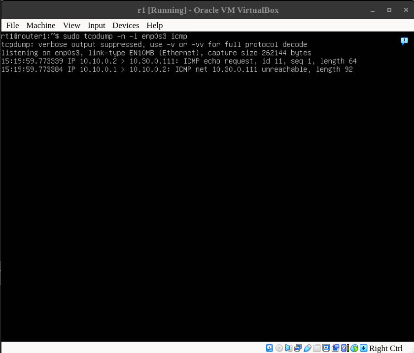
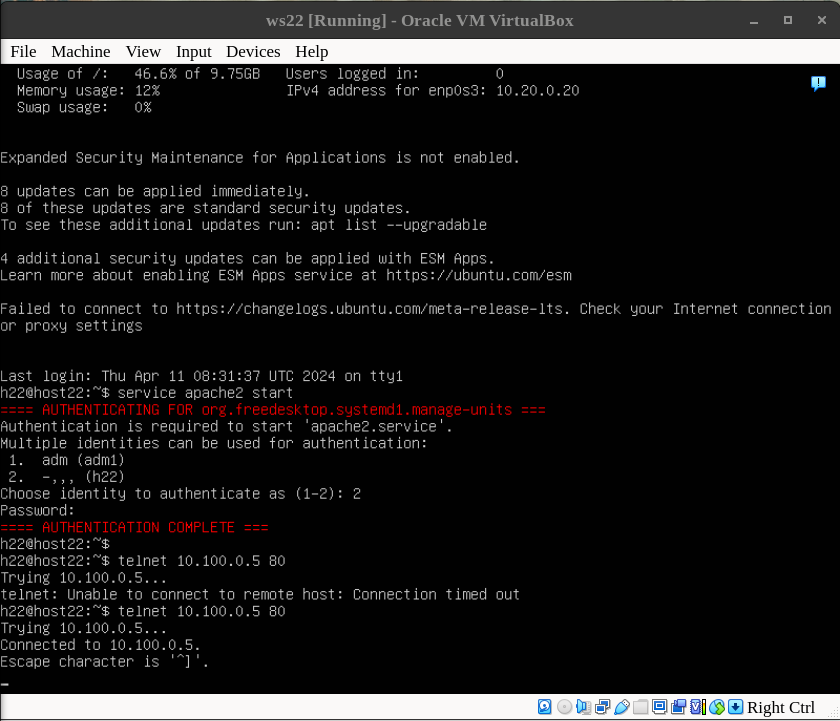

# Report of the project "Linux operating systems I" .

## Contents

1. [Part 1. **ipcalc** tool](#part-1-ipcalc-tool)
2. [Part 2. Static routing between two machines](#part-2-static-routing-between-two-machines)
3. [Part 3. **iperf3** utility](#part-3-iperf3-utility)
4. [Part 4. Network firewall](#part-4-network-firewall)<br>
    4.1. [`iptables` utility](#1-iptables-utility)<br>
    4.2. [`nmap` utility](#2-nmap-utility)<br>
5. [Part 5. Static network routing](#part-5-static-network-routing)<br>
    5.1. [Start five virtual machines.](#1-start-five-virtual-machines-3-workstations-ws11-ws21-ws22-and-2-routers-r1-r2)<br>
    5.2. [IP routes configuration files:](#2-screenshots-of-the-etcnetplan00-installer-configyaml-files)<br>
    5.3. [Enabling IP forwarding](#6-enabling-ip-forwarding)<br>
    5.4. [Default route (gateway) configuration](#7-default-route-gateway-configuration)<br>
    5.5. [Checking if IP forwarding and gateway configueation](#8-checking-if-ip-forwarding-and-gateway-configueation-done-correctly)<br>
    5.6. [Adding static routes for routers to other networks](#9-adding-static-routes-for-routers-to-other-networks)<br>
    5.7. [Making a router list](#12-making-a-router-list)<br>
6. [Part 6. Dynamic IP configuration using **DHCP**](#part-6-dynamic-ip-configuration-using-dhcp)<br>
    6.1. [Install and configure the **DHCP** service on server](#‎)<br>
    6.2. [Activate *dhcp* for a host](#e2808e-1)<br>
    6.3. [The real way to work with **DHCP** service](#e2808e-2)<br>
    6.4. [Make **DHCP** service strictly link address to the MAC-address of the host](#e2808e-3)<br>
    6.5. [Request *ip address* update from a host](#e2808e-4)<br>
7. [Part 7. **NAT**](#part-7-nat) <br>
    7.1. [**SNAT** and **DNAT**](#e2808e-5) <br>
8. [Part 8. Bonus. Introduction to **SSH Tunnels**](#part-8-introduction-to-ssh-tunnels)<br>
    8.1. [**SSH** and **TCP forwarding** ](#e2808e-6)<br>
9. [The grand finale](#finale)

## Part 1. **ipcalc** tool

1. Start the first virtual machine (aka ws1, aka usm_1)


2. network address of *192.167.38.54/13* is **192.160.0.0**
3. 
   | normal | prefix | binary |
   |---|---|---|
   | *255.255.255.0* | /24 | 11111111.11111111.11111111.00000000 |
   | 255.254.0.0 | */15* | 11111111.11111110.00000000.00000000 |
   | 255.255.255.240 | /28 | *11111111.11111111.11111111.11110000* | 
4. <br>
    4.1. **12.167.38.4/16** ==> HostMin = 12.167.0.1; HostMax=12.167.255.254 <br>
    4.2. **12.167.38.4/4** ==> HostMin = 0.0.0.1; HostMax=15.255.255.254<br>
    4.3. **12.167.38.4/8** ==> HostMin = 12.0.0.1; HostMax=12.255.255.254<br>
    4.4. **12.167.38.4/255.255.254** ==> HostMin = 12.167.38.1; HostMax=12.167.39.254<br>
    
5. An application running on localhost can be accessed via:*127.0.0.2*, *127.1.0.1*;
and can't be accessed via: *194.34.23.100*, *128.0.0.1*.
    
    

6. 
   | public | private | 
   |---|---|
   | 134.43.0.2 | 10.0.0.45 |
   | 172.0.2.1 | 192.168.4.2 |
   | 192.172.0.1 | 172.20.250.4 |
   | 172.68.0.2 | 172.16.255.255 |
   | 192.169.168.1 | 10.10.10.10 |

7. for *10.10.0.0/18* network possible addresses are *10.10.0.2*, *10.10.10.10* and *10.10.1.255* (impossible:*10.0.0.1*,*10.10.100.1*).

## Part 2. Static routing between two machines

1. Start the second virtual machine (aka ws2, aka usm_2)


2.  The network interfaces (`ip a`/`ifconfig`):
    | usm_1 | Usm_2 | 
    |---|---|
    |  |  |

    2.1. ***(ENG)***  
        **Loopback** - is an  interface that allows communication with the host OS. SO it is selfcommunication. <br>
            **Broadcast** - mean that the connection supports  sending data to all listeners in a subnet.<br>
            **Multicast** - mean that the connection supports sending data to a group of listeners in net (not all and not one).<br>
            * It does mean  that you can send data to any particular listeners in this network too. 
        ***(РУС)***
        **Loopback** — интерфейс, позволяющий осуществлять связь с *ОС хоста* - обратная связь. <br>
            **Broadcast** – означает, что соединение поддерживает отправку данных всем приемникам в подсети.<br>
            **Multicast** - означает, что соединение поддерживает отправку данных группе приемников в сети (не всем и не одному).<br>
3. Making internal ips, masks (if needed gw, dns) settings static:
    ```
    sudo netplan --debug generate
    ls /etc/netplan/            (ex.00-installer-config.yaml or 01-netcfg.yaml)
    sudo nano /etc/netplan/00-installer-config.yaml
    ```
    | Modify the file |**usm_1**|**usm_2**|
    |---|---|---|
    |  |  |  |

    * public DNS servers: e.g. 1.1.1.1 or 8.8.8.8
4. `netplan apply` to restart the network service and `ip a` to check if the ips changed.
    
    
    
5. To add a static route from one machine to another, you can use the following syntax: `ip r add destination-network via gateway-ip [dev interface]` - this connections will be temporal, or b write routes manually in file *usm_2 00-installer-config.yaml or 01-netcfg.yaml* - this will survive restarting the machine.

6. 
    |`ping -c 25 172.24.116.8`|`ping -c 15 192.168.100.10` |
    |---|---|
    | |  |


7. Result *00-installer-config.yaml* files:

    |**usm_1**|**usm_2**|
    |---|---|
    | |  |

8. 
    |`ping -c 25 172.24.116.8`|`ping -c 15 192.168.100.10` |
    |---|---|
    | |  |


## Part 3. **iperf3** utility

1. [Calcul](media/f@ck_1.png)[ations:](media/f@ck_2.png)<br>
    8 Mbps = 1 MB/s <br> 
    100 MB/s = 819200 Kbps, <br>
    1 Gbps = 1024 Mbps
2. Measurin connection speed between usm_1 and usm_2:
    ```
    iperf3 -s -f K                 #server part (usm_2)
    iperf3 -c 172.24.116.8 -f K    #client part (usm_1)
    ```

    


## Part 4. Network firewall

#### 1. `iptables` utility

1.1. Creatring rules the firewall:<br>
* To set firewall rules we create */etc/firewall.sh* and adjust it accordingly: <br>

        #!/bin/sh

        # Deleting all the rules in the "filter" table (default).
        iptables -F
        iptables -X

        #For ping
        sudo iptables -A OUTPUT -p icmp --icmp-type echo-reply -j REJECT

        #For SSH
        sudo iptables -A INPUT -p tcp --dport 22 -j ACCEPT

        #For HTTP
        sudo iptables -A INPUT -p tcp --dport 80 -j ACCEPT
<br>

* There must be differences according the the task in usm_1 and usm_2 files:

    |**usm_1**|**usm_2**|
    |---|---|
    | |  | 
    | First deny then allow PING |First allow then deny PING|

    * **iptables -F** deleting all the previos rules (to be more specific it flushes all the rules in the IP packet filter rules table in the Linux kernel, effectively deleting all the rules and restoring the firewall to its default state).
    * **iptables -X** is used to delete a user-defined chain.
    * **-A OUTPUT** specify tha the rule  will apply to outgoing packets from our system.
    * **-A INPUT** is used to rule the incoming packages.
    * **-p icmp** option specifies that the rule should match ICMP (Internet Control Message Protocol). ICMP is a protocol used by network devices to communicate error messages and operational information about network conditions.
    * **icmp-type echo-reply** that the type of ICMP packet is *echo reply* aka  *Ping* reply.
    * **-p tcp** option specifies that the rule should apply to TCP traffic (Transmission Control Protocol).
    * **--dport 22** option specifies that the rule should apply to traffic destined for port 22 (same goes  for 80).
    * **-j REJECT** tells to reject the packet.
    * **-j ACCEPT** tells to accept the packet.

1.2. To activate the rules  you need to run the script as root user with commands:

    sudo chmod +x /etc/firewall.sh
    sudo /etc/firewall.sh


1.3. To check if  the rules are working correctly, we can use the *ping* comand:
|`ping -c 15 172.24.116.8`|`ping -c 15 192.168.100.10` |
|---|---|
| |  |

| ENG | РУС | 
|---|---|
| As we can see from these screenshots the first rule in the document is more important that the second one. So if the rule is made,  without deleting all the previous rules new similar one won't work. The rule higher in the document (higher in the chain) is more valuable.  | Как видно из этих скриншотов, первое правило в документе важнее второго если правила относятся к одному типу подключения. То есть если правило создано, то без удаления всех предыдущих правил новое подобное работать не будет. Правило, расположенное выше в документе (выше в цепочке) является более ценным. |

#### 2. `nmap` utility
* To use the nmap utility to show that a machine is up, you can use the command `nmap -sP <host>`, where *\<host\>* is the IP address or hostname of the machine you want to check. The -sP option tells nmap to perform a ping scan, which will show whether the machine is responding to pings.

| usm_1 | Usm_2 | 
|---|---|
| |  |

* `nmap` can scan all ports to determine if the host is up.

## Part 5. Static network routing

Network: \


#### 1. [Start](extra/setting_up_5.md) [five](media/wtf_8.png) virtual machines (3 workstations (ws11, ws21, ws22) and 2 routers (r1, r2)).

Mashines initial info:
| Name | Short<br>Name | Hostname | User | Networks | IPs | Connected<br> hosts/routers |
|---|---|---|---|---|---|---|
| Router #1 | r1 | router1 | rt1 |10.10.0.0/18 (1) <br> 10.100.0.0/16 (2) |10.10.0.1/18 <br> 10.100.0.11/16 |10.10.0.2/18|
| Router #2 | r2 | router2 | rt2 |10.100.0.0/16 (2) <br> 10.20.0.0/26 (3)|10.100.0.12/16  <br> 10.20.0.1/26 | 10.20.0.10/26 <br>  10.20.0.20/26 |
| Host #1.1 | ws11 |host11|h11|10.10.0.0/18 (1)|10.10.0.2/18 | 10.10.0.1/18 |
| Host #2.1 | ws21 |host21|h21|10.20.0.0/26 (3)|10.20.0.10/26|10.20.0.1/26|
| Host #2.2 | ws22 |host22|h22|10.20.0.0/26 (3)|10.20.0.20/26|10.20.0.1/26|
<br><br>

#### 2. Screenshots of the *etc/netplan/00-installer-config.yaml* files:

| Machine | Screenshot <br> Begining of *Part 5* | Screenshot <br> Final of *Part 5* |
|---|---|---|
| Router #1 (r1) |  ||
| Router #2 (r2) |   ||
| Host #1.1 (ws11) |   ||
| Host #2.1 (ws21) |   ||
| Host #2.2 (ws22) |   ||
<br><br>

3. Checking that the machine address is correct with the `ip -4 a`command:

    | Machine | Screenshot | 
    |---|---|
    |Router #1 (r1)| |
    |Router #2 (r2)| |
    |Host #1.1 (ws11)||
    | Host #2.1 (ws21) |   |
    | Host #2.2 (ws22) |   |
<br><br>

4. Pinging ws22 from ws21:

    
<br><br>

5. Pinging r1 from ws11:

    
<br>

#### 6. Enabling IP forwarding 


6.1. Enabling IP forwarding by running the `sysctl -w net.ipv4.ip_forward=1` command on both router machines. Note that after using this command, the forwarding will not work after the system is rebooted.

| Machine | Screenshot | 
|---|---|
|Router #1 (r1)| |
|Router #2 (r2)| |

* IP forwarding (aka IP routing) is the process of forwarding network packets from one network interface to another (based on the destination IP address of the packet). When a packet arrives at a network device, such as a router or a computer with multiple network interfaces, the device checks the destination IP address of the packet and determines which interface to use to forward the packet to its destination.

6.2. Open **/etc/sysctl.conf** file (on routers) and add the following  line: `net.ipv4.ip_forward=1`. This way the forwarding will be enabled permanently (will work after rebooting of the system).

| Machine | Screenshot | 
|---|---|
|Router #1 (r1)| |
|Router #2 (r2)| |

#### 7. Default route (gateway) configuration

7.1. To configure the default route (gateway) for the workstations the one need to  add `default` as a destination (after *- to:*) and  the router's IP as a way (after *via:*) in the configuration file (**etc/netplan/00-installer-config.yaml**). Command `ip r` can be used after the check the activeness of the gateway (that all the adjustments took place).

| Machine | Screenshot #1 | Screenshot #2 | 
|---|---|---|
|Host #1.1 (ws11)|||
| Host #2.1 (ws21) |   ||
| Host #2.2 (ws22) |   ||


* static straight connections between hosts and routers can be removed, they are not needed any more.


#### 8. Checking if IP forwarding and gateway configueation done  correctly

8.1. It can be done by **ping** *r2* router from *ws11*, at the same time we can use **tcpdump** on the second machine (*router #2*), this will show us that the ping is reaching.

* The **tcpdump** command is a tool for network diagnostics and analysis. It allows you to capture and display network traffic in real time.
    * The **-t** option tells *tcpdump* not to print the timestamps for each packet.
    * The **-n** option tells *tcpdump* not to convert IP addresses and port numbers to hostnames and service names.
    * The **-v** option tells *tcpdump* to print verbose output, which includes additional information about each packet (such as the packet length, the link-layer header, and the type of service (TOS) field)
    * The **-i ...** option specifies the network interface to capture packets from.
```bash
#On Host #1.1 (ws11)
ping -c 25 10.100.0.12

#On Router #2 (r2)
sudo tcpdump -tn -i enp0s3
```

8.2. ScreenShots:
| Host #1.1 (ws11) | Router #2 (r2) | 
|---|---|
|  |  |

#### 9. Adding static routes for routers to other networks

9.1. Add static routes for **r1** to **network #3**(10.20.0.0/26) via **r2** (through **network #2**(10.100.0.0) by adjusting *etc/netplan/00-installer-config.yaml* file of *r1*.


9.2. Add static routes for **r2** to **network #1**(10.10.0.0/18) via **r1**  (through **network #2**(10.100.0.0) by adjusting *etc/netplan/00-installer-config.yaml* file of *r2*.


<br><br>

10. `ip r`

    | Machine | Screenshot | 
    |---|---|
    |Router #1 (r1)| |
    |Router #2 (r2)| |
<br>

11. Runing on Host #1.1 (ws11):
    ```bash
    ip r list 10.10.0.0/18
    ip r list 0.0.0.0/0
    ```

    

    ****ENG****
    * The `ip r list 0.0.0.0/0` command displays the default route ("default gateway") in the Linux routing table. Because it basically translates like "list me routes to ANYTHING".
    * in output:
        * **default**  indicates that the route is the default route, which matches all destinations that are not explicitly defined in the routing table.
        * **via ...** - the next device that packets should be forwarded to when using this route (trying to get to the IP from input)(ex. Router #1).
        * **dev ...** - the network interface that should be used to send packets using this route (getting to the IP from input).
        * **proto** indicates the routing protocol that was used to learn this route. 
            * **"static" protocol** means that it was manually configured by an administrator.
            * **kernel** means that the route was automatically installed by the kernel.
        * **scope** indicates the scope of the route, which determines the range of destinations that the route applies to. 
            * **link** means that the route applies to the local network that the device is connected to.
        * **src**  show IP address that is used for packets sent over the route (most common the device the command is used on now). The *src* keyword is typically used in the context of a directly connected route, which is a route that is associated with a network interface. 

    * In most cases, it is not necessary to use the **default** route to connect to the local network. This is because the local network is directly connected to the host, and the host can send packets directly to other hosts on the same network without the need for a *gateway*. When a host sends a packet to another host on the same network, it uses the IP address of the outgoing interface (self IP) as the source IP address, and it sends the packet directly to the destination IP address. This is known as a "directly connected" route, and it is typically installed automatically by the kernel when the network interface is configured.

    ****РУС****
    * Команда `ip r list 0.0.0.0/0` отображает маршрут по умолчанию («шлюз по умолчанию») в таблице маршрутизации Linux. Так как дословно такая команда переводится как "покажи дорогу к чему-либо".
    * вывод:
        * **default** указывает, что маршрут является маршрутом по умолчанию, который соответствует всем пунктам назначения, которые явно не определены в таблице маршрутизации.
        * **via ...** - следующее устройство, на которое должны пересылаться пакеты при использовании этого маршрута. В данном случае (например, роутер).
        * **dev ...** — сетевой интерфейс, который должен использоваться для отправки пакетов по данному маршруту.
        * **proto** указывает протокол маршрутизации, который использовался для получения информауии про этот маршрут.
            * **"static" protocol** означает, что он был настроен вручную.
            * **kernel** означает, что маршрут был автоматически установлен ядром.
        * **scope** указывает область маршрута, определяющую диапазон пунктов назначения, к которым применяется маршрут.
            * **link** означает, что маршрут применяется к локальной сети, к которой подключено устройство.
        * **src** показывает IP-адрес, который используется для пакетов, отправляемых по маршруту (чаще всего это устройство, на котором применена команда). Ключевое слово *src* обычно используется в контексте маршрута с прямым подключением, то есть маршрута, связанного с сетевым интерфейсом.

    * В большинстве случаев нет необходимости использовать маршрут по умолчанию для подключения к локальной сети. Это связано с тем, что локальная сеть напрямую подключена к хосту, и хост может отправлять пакеты напрямую другим хостам в той же сети без необходимости использования шлюза. Когда хост отправляет пакет другому хосту в той же сети, он использует IP-адрес исходящего интерфейса (свой IP) в качестве IP-адреса источника и отправляет пакет непосредственно на IP-адрес назначения. Это называется маршрутом с «прямым подключением», он обычно устанавливается ядром автоматически при настройке сетевого интерфейса.


#### 12. Making a router list

* **traceroute** is a network utility that is used to trace the path that a packet takes from the source host to the destination host. It works by sending a series of packets with increasing "time to live"* (TTL*) values, and measuring the time it takes for each packet to reach the destination or to be returned by a router along the path. When a packet is sent with a TTL* value of 1, it can only reach the first hop along the path, which is typically the default gateway. If the packet is not returned by the first hop, traceroute assumes that the hop is unreachable and reports an error. If the packet is returned by the first hop, traceroute extracts the IP address of the hop and the TTL* value that was used, and then sends a new packet with a TTL* value of 2. This packet can reach the second hop along the path, and the process is repeated until the packet reaches the destination or until all hops have been reached.

    12.1. Run the `sudo tcpdump -tnv -i enp0s3` dump command on *r1*<br>
    12.2. Use `traceroute 10.20.0.10` (the IP of *ws21*) on *ws11* - this will list routers in the path from  *ws11* to *ws21*.

    | Machine | Command | ScreenShot |
    |---|---|---|
    | Host #1.1 (ws11) | `traceroute 10.20.0.10` | ") |
    | Router #1 (r1) | `sudo tcpdump -tnv -i enp0s3` |  #1") |
    | Router #1 (r1) | `sudo tcpdump -tn -i enp0s3` |  #2") |

    12.3.<br>
    ****(ENG)**** According to information above and screenshots, in simple words we can discribe work of **traceroute** the following way. The client device sends several packages with different TTL* (time of life*) towards the destination. As a package's time to be gone comes a gateway (router, etc) it ended up at sends the original host information about package's "death". Usinge right ammount of packages aka small enough time delta between the package sending the full route of the package can be mapped.<br><br>
    ****(РУС)**** Судя по информации выше и скриншотам, простыми словами работу **traceroute** можно описать следующим образом. Клиентское устройство отправляет несколько пакетов с разным TTL* (сроком жизни) к приемнику. Когда пакету приходит пора исчезнуть, шлюз (маршрутизатор и т. д.), на котором он оказался, отправляет исходному хосту информацию о «смерти» пакета. Используя правильное количество пакетов, то есть достаточно небольшую разницу между временами отправки пакетов, можно отобразить полную карту пути.


    \* The "time to live" (TTL) of a packet is a field in the IP header that specifies the maximum number of hops that the packet is allowed to pass through or the actual time (seconds) it must be present. The TTL value is used to prevent packets from circulating indefinitely in the network and causing congestion or other issues. The TTL value is set by the sender of the packet, and it is decremented by each router that the packet passes through (or by the time goes). If the TTL value reaches 0, the router discards the packet and sends an "ICMP Time Exceeded" message back to the sender.
<br><br>


13. Using **ICMP** protocol in routing

* The Internet Control Message Protocol (ICMP) is a network protocol that is used to send error messages and operational information about network conditions. ICMP is an integral part of the Internet Protocol (IP) and is used by network devices (routers etc), to send error messages indicating (ex. a requested service is not available; a host or router could not be reached). ICMP does not establish a connection between the sender and the receiver before sending data. Instead, ICMP packets are sent as independent datagrams, and they are not guaranteed to be delivered to the intended recipient.

    13.1. Run `sudo tcpdump -n -i enp0s3 icmp` command on *r1*
    
    13.2. Ping a non-existent IP (`ping -c 1 10.30.0.111`) from *ws11*

    | Machine  | ScreenShot |
    |---|---|
    | Router #1 (*r1*) |  |
    | Host #1.1 (*ws11*) |  |


## Part 6. Dynamic IP configuration using **DHCP**
* DHCP (Dynamic Host Configuration Protocol) is a network protocol used to dynamically assign IP addresses and other network configuration parameters to devices on a network so they can communicate with each other. When a device connects to a network, it sends a broadcast message requesting an IP address. A DHCP server on the network receives this request and responds with an available IP address and other network configuration information(default gateway, subnet mask, and DNS servers).
###### ‎ 
1. Need to install **DHCP** service first:          
    ```shell
    sudo apt-get install isc-dhcp-server        # Install DHCP server
    sudo systemctl start isc-dhcp-server        # Start DHCP server
    sudo systemctl enable isc-dhcp-server       # Enable DHCP server at boot
    ```

2. Configure the **DHCP** service for *r2*

    2.1. Adjust the **/etc/dhcp/dhcpd.conf** file<br>

    ```shell
    # Global Directives

    # DHCP scope
    #network-2
    subnet 10.100.0.0 netmask 255.255.0.0 {}

    #network-3
    subnet 10.20.0.0 netmask 255.255.255.192
    {
        range 10.20.0.2 10.20.0.50;
        option routers 10.20.0.1;
        option domain-name-servers 10.20.0.1;
    #    option domain-name-servers 8.8.8.8, 8.8.4.4;
    #    option broadcast-address 10.20.0.63;   
    }
    ```

    

    2.2. Write `nameserver 8.8.8.8` in a **resolv.conf** [file](media/s-sh60.png "or is it  /etc/resolve.conf ?").

    * The *nameserver 8.8.8.8* directive in a *resolv.conf* file specifies that the DNS server with IP address *8.8.8.8* should be used for resolving domain names (this is needed bue to manual configuring network settings).
    * In the **/etc/dhcp/dhcpd.conf** we used the **r2 (10.20.0.1)** as DNS server, so we need to specify the DNS addresses/DNS addresses source in **resolv.conf** now.

    <br>

    2.3. Restart the **DHCP** service with `sudo systemctl restart isc-dhcp-server`<br>
    2.4. Reboot the ws21 machine with `sudo reboot`

###### ‎ 
3. Now it's needed to activate *dhcp* for the device.

    3.1. Adjust **/etc/netplan/00-installer-config.yaml** (otherwise the static IP addresses we creates earlyer will still [stay](media/s-sh61.png "ip a && ping -c 2 10.20.0.10 && ping -c 2 10.20.0.20")):

    

    Afterwards:
    ```shell
    sudo netplan  apply
    sudo systemctl restart isc-dhcp-server
    sudo reboot
    ```


4. Use command `ip a` to show that *r2* has got an address and `ping` *ws22* and *ws21*.

    

    * As we can see *router #2 (r2)* got new IPs in both networks. And still be able to connect to *ws1* and *ws2* using their old IPs. But this way *r2*
###### ‎ 
*. [Let's  try different approach](extra/extra_way_1.md)


5. Specify MAC address of ws11
    * A MAC (Media Access Control) address is a unique identifier assigned to a network interface controller (NIC) for use as a network address in communications within a network segment. This unique identifier is stored in the hardware of the NIC and is used to identify the device on a network. The MAC addresses are unique to each NIC produced. MAC addresses are used to identify devices on a network and to facilitate communication between devices. 

    5.1. to Specify MAC address we need to add line `macaddress: 10:10:10:10:10:BA` afte line `dhcp4: true` in  */etc/netplan/00-installer-config.yaml*. And let's not forget about changing the MAC address in the *VirtualBox*'s *ws11* settings.

    
    
###### ‎ 
6. Сonfigure *r1* the same way as *r2* but make the assignment of address strictly linked to the MAC-address for *ws11*.

    6.1. install **DHCP** services.

    6.2. Adjust **/etc/netplan/00-installer-config.yaml** and save changies (run `sudo netplan apply`):

       

    6.3. Adjust the **/etc/dhcp/dhcpd.conf** file the same way as *r2* but add special rule for *ws11* so it's IP will depend on MAC address, this rule shoulb be added into the according subnet part.

    ```shell
    # DHCP scope
    #network-1
    subnet 10.10.0.0 netmask 255.255.192.0 {
        range 10.10.0.2 10.10.63.100;
        option routers 10.10.0.1;
        option domain-name-servers 10.10.0.1;
    #    option domain-name-servers 8.8.8.8, 8.8.4.4;
    #    option broadcast-address 10.10.63.255;
        host ws11 {
            hardware ethernet 10:10:10:10:10:BA;
            fixed-address 10.10.0.5;
        } 
    }
    #network-2
    subnet 10.100.0.0 netmask 255.255.0.0 {}
    
    ```
    
     

    6.4.  Write `nameserver 8.8.8.8` in the **resolv.conf** file.

    <br>

    6.5. Restart the **DHCP** service with `sudo systemctl restart isc-dhcp-server`<br>
    6.6. Reboot the *ws21* machine with `sudo reboot`

    6.7 Command `ip a` to show that *r1* has got new address in *network 2*:

    
###### ‎ 
7. Request ip address update for *ws21*  by running following comands:
    ```
    sudo dhclient -r enp0s3             #release current
    sudo dhclient enp0s3                #get new one
    ```

    7.1. *ws11*'s ip before and after update:

    

    7.2. 
    | ENG | РУС | 
    |---|---|
    | DHCP (Dynamic Host Configuration Protocol) server options are tagged data items that provide information to a DHCP client. These options are sent in a variable-length field at the end of a DHCP message. In previous steps we have used several of them: <br> *  Subnet mask to be applied on the interface asking for an IP address.<br> * Default router or last resort gateway for this interface.<br> *  Specifies the DNS server IP address to be assigned to the clients.<br> * Broadcast address to be assigned to the client. |Параметры сервера DHCP — это помеченные элементы данных, которые предоставляют информацию DHCP-клиенту. Эти параметры отправляются в поле переменной длины в конце сообщения DHCP. На предыдущих шагах мы использовали несколько из них: <br> * Маска подсети, которая будет применена к интерфейсу, запрашивающему IP-адрес.<br> * Маршрутизатор по умолчанию или шлюз последней инстанции для этого интерфейса.<br> *   Oпределяет IP-адрес DNS-сервера, который будет назначен клиентам.<br> *   Aдрес, который будет назначен клиенту.|

## Part 7. **NAT**

* Network Address Translation (NAT) is a mechanism that allows multiple devices on a private network to share a single public IP address. NAT is typically used in scenarios where a private network needs to connect to the Internet, but the number of available public IPs is limited. When a device on the private network sends a packet to the Internet, the NAT device (usually a router) modifies the source IP address of the packet to be the public IP address of the NAT device. The NAT device also keeps track of the mapping between the private IP address of the device and the public IP address used in the packet. When the NAT device receives a response packet from the Internet, it uses the mapping information to determine the original private IP address of the device and modifies the destination IP address of the packet to be the private IP address. The NAT device then forwards the packet to the appropriate device on the private network.

    1. In **/etc/apache2/ports.conf** file change the line `Listen 80` to `Listen 0.0.0.0:80`on *ws22* and *r1*, i.e. make the Apache2 server public.
        * Apache2 is a web server software that is used to serve web content over the internet. It acts as a middleman between the server and client machines, pulling content from the server on each user request and delivering it to the web. It is open source and highly customizable, it supports a wide range of functionalities, including: serving static and dynamic web content, running CGI scripts, supporting various programming languages such as PHP, Python, and Perl, URL rewriting and redirection, authentication and authorization, SSL/TLS encryption for secure communication over HTTPS, load balancing and failover, compression and caching for improved performance, virtual hosting for running multiple websites on a single server.

        1.0. First apache2 needs to be installed:
        ```shell
        sudo apt-get update
        sudo apt-get install apache2
        sudo systemctl start apache2
        sudo systemctl enable apache2
        ```
        
        1.1 Open port 
        | Host #2.2 (ws22) | Router #1 (r1) | 
        |---|---|
        |  |  |

    2. Start the Apache web server/restart with on *ws22* and *r1*
        ```shell
        sudo service apache2 start
                    OR
        sudo service apache2  restart
        ```
        | Host #2.2 (ws22) | Router #1 (r1) | 
        |---|---|
        |   [*](media/s-sh71.png "WRONG?")|   [*](media/s-sh72.png "WRONG?")|

    3. Add rules to firewall on *r2* and run it

        3.1 Creatring rules the firewall - create */etc/firewall.sh* and adjust it accordingly:

        ```shell
        #!/bin/sh

        #Deleting all the previous rules in the "filter" table (default).
        iptables -F
        iptables -X

        #Delete all the previous rules in the "NAT" table 
        iptables -F -t nat

        #Drop all routed packets
        iptables --policy FORWARD DROP
        ```
        * **iptables -F** deleting all the previos rules (to be more specific it flushes all the rules in the IP packet filter rules table in the Linux kernel, effectively deleting all the rules and restoring the firewall to its default state).
        * **iptables -X** is used to delete a user-defined chain.
        * **iptables -F -t nat**  will remove all rules in the NAT table, effectively resetting the NAT firewall configuration (NAT table is used to manipulate the IP addresses of packets as they pass through the firewall). This is useful in scenarios where multiple devices are sharing a single public IP address and there is a firewall on this device (router), or where traffic needs to be routed through a firewall to reach its destination.
        * **iptables --policy FORWARD DROP**  sets the default policy for the FORWARD chain to DROP, which means that all incoming packets that are meant to be forwarded to another network interface will be dropped.

        * **-A FORWAR** is used to filter packets that are being forwarded from one network interface to another.
        * **-A PREROUTING** adds a rule to *PREROUTING chain* that is used to modify the destination of incoming packets before they are routed to their final destination.
        * **-p icmp** option specifies that the rule should match ICMP (Internet Control Message Protocol). 
        * **-p tcp** Specify that the rule applies to TCP (Transmission Control Protocol) packets.
        * **-t nat** specifies the NAT table in the firewall, which is used to perform network address translation.
        * **-A POSTROUTING** appends a new rule to the *POSTROUTING chain* in the NAT table. The *POSTROUTING chain* is used to modify the routing of packets after the routing decision has been made.
        * **-o ...**: This specifies the outgoing network interface for the rule (the one that goes to the internet). 
        * **-s .../..** This specifies the local network IP and mask (the one that  sends the packet).
        * **-j ACCEPT** tells to accept the packet.
        * **-j SNAT**: This specifies the target of the rule, which is SNAT.
        * **-j DNAT** Specify the target of the rule - which is DNAT. 
        * **--to-source ...**: This specifies the IP address to use as the new source IP address for the packets (the outgoing IP address - public IP address). 
        * **--dport ...**: Specify what *port* that the rule applies to.
        * **--to-destination ....:...** - specify the IP **address** and **port** number to use as the new destination IP address and port number for the packets.


        3.2. To activate the rules  you need to run the script as root user with commands:
        ```shell
        sudo chmod +x /etc/firewall.sh
        sudo /etc/firewall.sh
        ```
    4. Using `ping` command we can establish that there is no connection between *ws22* and *r1*:

        

    5. Adjust the firewall file of *r2* (*/etc/firewall.sh*)

        5.1. add to the file:
        ```shell
        #Allow forwarding of all ICMP protocol packets
        iptables -A FORWARD -p icmp -j ACCEPT
        ```
        5.2. activate the changies the same way as in **Part 7 3.2.**

    6. Ping *ws22* from *r1*  again, now the result should be different:

        
    ###### ‎ 
    7. Enable **SNAT**
        * SNAT (Source Network Address Translation) is a type of NAT (Network Address Translation) that is used to change the source IP address of a packet to a different IP address. SNAT is typically used in scenarios where a device on a private network needs to communicate with a device on a public network, such as the Internet. 

        * To enable **SNAT**:
        ```shell
        sudo iptables -t nat -A POSTROUTING -o enp0s3 -j SNAT --to-source 10.100.0.4
        ```

    8. Enable **DNAT**
        * DNAT (Destination Network Address Translation) is a type of network address translation that is used to modify the destination IP address and/or port number of incoming packets. DNAT is typically used to forward incoming traffic from one network to another, or to provide access to services that are running on a private network from the Internet (ex. DNAT forward incoming traffic on port 80 (HTTP) from the Internet to the web server on the private network).

        * To enable **DNAT** to *ws22*:
            ```shell
            sudo iptables -t nat -A PREROUTING -p tcp --dport 8080 -j DNAT --to-destination 10.20.0.20:80
            ```

            

    9.  To add external network access to the *Apache web server* running on *ws22* by adding to **/etc/apache2/ports.conf** folowing:

        ```
        Listen <external_ip_address>:80
        ```
        * In our case we just check that it is already activated (`Listen 0.0.0.0:80`) and that there are not *ws22*'s firewall rules against that(`sudo iptables -L -v`):

        

        

    10. Checking the TCP connection for **SNAT** by connecting from *ws22* to the Apache server on *r1* with the following command.
        ```shell
        telnet 10.100.0.5 80            #telnet [address] [port]
        ```
        

    11. Check the TCP connection for **DNAT** by connecting from *r1* to the Apache server on *ws22* with the following command (this time we use address of *r2* and *port 8080*).
        ```shell
        telnet 10.100.0.4 8080            #telnet [address] [port]
        ```

        


## Part 8. Introduction to **SSH Tunnels**

* An **SSH (Secure Shell) tunnel** is a method of creating a secure connection between two hosts over an insecure network. It allows users to securely transfer data between the two hosts by* encrypting the data* and sending it over the insecure network. An *SSH tunnel* is created by establishing an *SSH* connection between the two hosts and then forwarding network traffic through the *SSH* connection. 

    1. Run a firewall on *r2* with all previous rules. 
    2. Start the **Apapche** web server on *ws22* on localhost only (i.e. in */etc/apache2/ports.conf* file change the line `Listen 80` to `Listen localhost:80`)
        * The `Listen` directive in *Apache2* specify the IP address and port number that the *Apache2 server* should listen on for incoming connections. `Listen localhost` means the *Apache2 server* will accept incoming connections only from the **localhost interface**. This means that *Apache* will only accept connections that originate from the **same machine** where *Apache* is running on. 

    ###### ‎ 
    3. **SSH** and **TCP forwarding** 
        * [Extra **SSH** and **TCP forwarding** information](extra/ssh_stuff.md) 
    4. Task: Use *Local TCP forwarding* from *ws21* to *ws22* to access the web server on *ws22* from *ws21*
        
        4.1. To do so, we need to set up an *SSH tunnel* from *ws21* to *ws22* to forward a local port of *ws21* to *ws22*'s port 80.  To activate *Local TCP forwarding* we will use folowing *SSH* command:

        ```shell
        #ssh -L <local_port>:<remote_host>:<remote_port> <remote_username>@<remote_hostname/ip_address>
        ssh -L 8080:127.0.0.1:80 adm1@10.20.0.20        
        ```

        
        
        4.2. To check if the connection worked we create a second terminal (Alt + F2) and run the `telnet 127.0.0.1 8080` command.

        

    5. Task: Use *Remote TCP forwarding* from ws11 to ws22 to access the web server on ws22 from ws11

        5.1. To do so what we basically would like to do is to set up the *SSH tunnel* from *ws22* to *ws11*so the information that goes to an open port of *ws22* would be fowarded to closed one. So the *SSH* command would look somethink like that:
        
        ```shell
        ssh -R 8080:10.20.0.20:80 adm1@10.20.0.20
        ```
            
        5.2. But  in our case *ws11* and *ws22* are not from the same network - there is thr *r2* router controlling the *ws22* local network. In that case it is easier to create a *SSH tunnel* from *ws22* to *r2* and let a last ones port be the "gate" to local *ws22* host. Let's adjust the command for our sinuation:

        ```shell
        ssh -R 10.100.0.4:8000:localhost:80 adm1@10.20.0.1        
        ```
        * We chose the *port 8000*.
        * If we get fail message that says "connection refused" we do need to chech active ports at *r2* `netstat -tuln`, and if needed add the line: `sudo iptables -A INPUT -p tcp --dport 22 -j ACCEPT` to the *firewall* to enable ssh connections.

        

        5.3. Let's slow down here. We did establish  an SSH connection, but we didn't allow to use this connection from outside (for any hosts from other networks). To do so we will adjust `/etc/ssh/sshd_config` file on *r2* - add `GatewayPorts yes` instead of default `#GatewayPorts no`. After that we will need either `sudo reboot` the *r2* or `sudo systenctl reload ssh`, and `sudo systenctl status ssh` afterwards. 

        

        * we should redo the *step 5.2* after that.

        5.4. To check if the connection worked we run the `telnet 10.100.0.4 8000` command on *r1*:

        

        5.5 And we can run the `telnet 10.100.0.4 8000` command on *ws11* too:

        

## Finale


