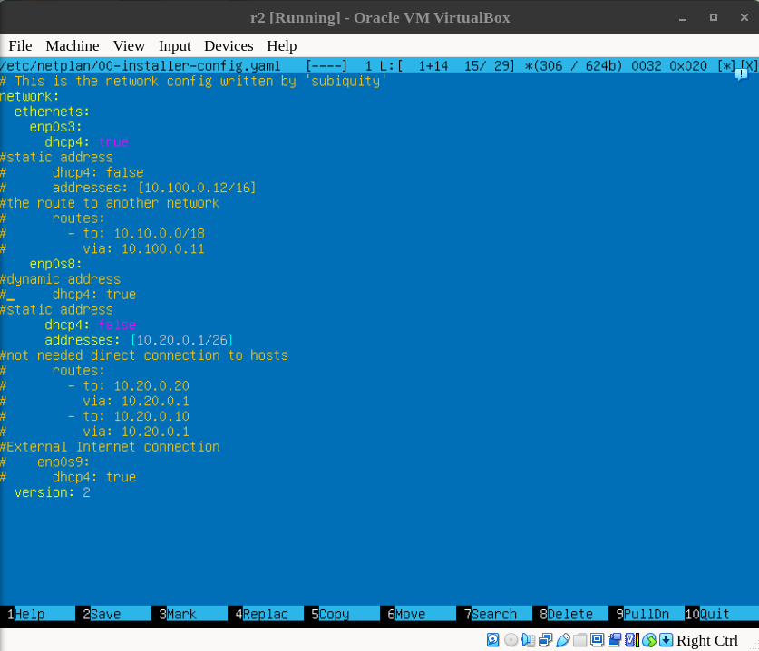
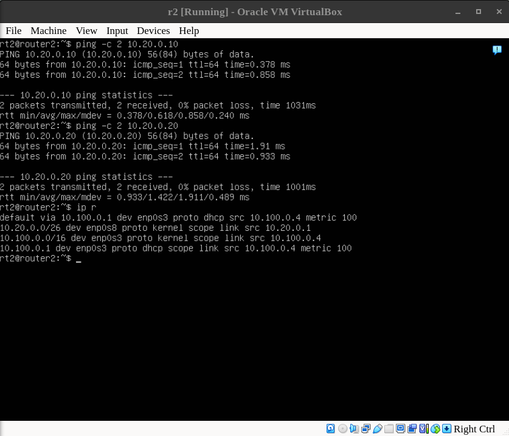
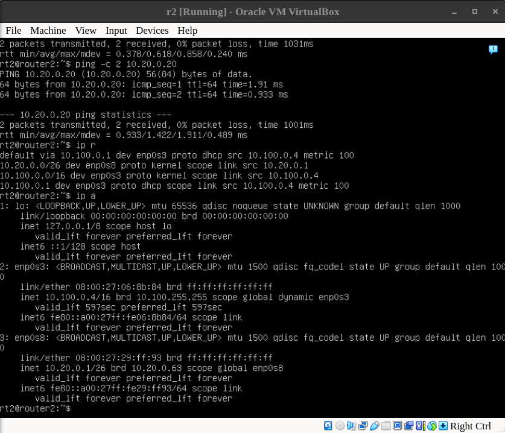
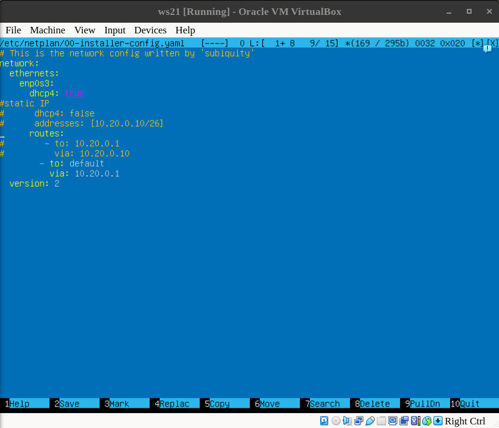
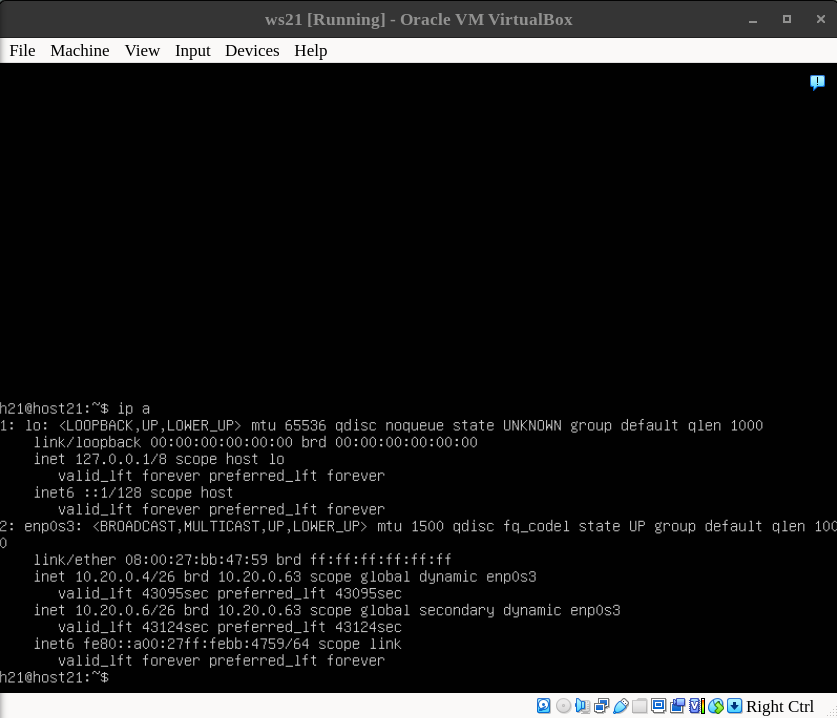
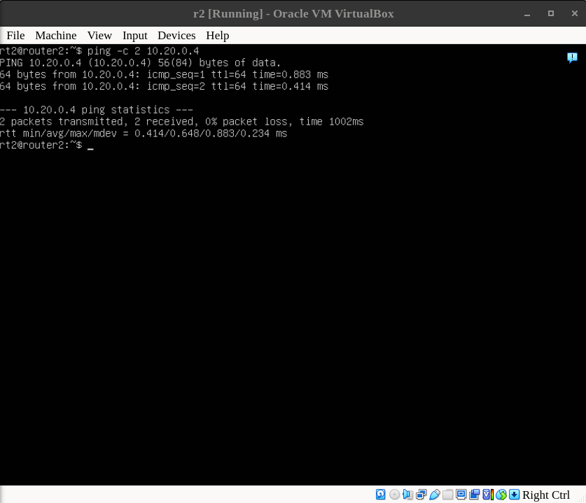

## Let's  try different approach

1. Let's keep the static IP for *Router #2 (r2)* in **/etc/netplan/00-installer-config.yaml** file.

    

2. If we do it *(r2)* will still work like router for *ws21* and *ws22*.
While at the same time will get a new address for the *Network 2*.

    

    

## Additional 

1. If we remove static IP from **/etc/netplan/00-installer-config.yaml** file for *ws21*:

    

2. This way *ws21* will get new IP address in range we assigned in the **/etc/dhcp/dhcpd.conf** file.

    

3. It can be *pinged* using new  IP address.

    

